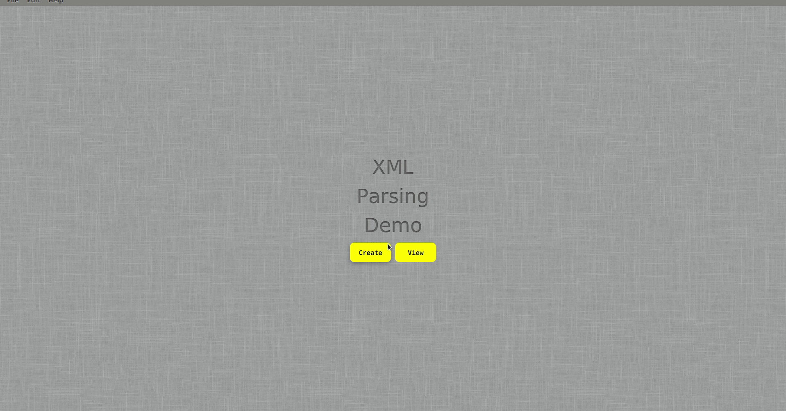

# Basic E-commerce application

This is a solution of creating and reading employees data from XML datasource

## Table of contents

- [Overview](#overview)
    - [Screenshot](#screenshot)
- [My process](#my-process)
    - [Built with](#built-with)
    - [Libraries](#Libraries)
- [Author](#authors)

## Overview

### GIF




<p align="right">(<a href="#top">back to top</a>)</p>

## My process
1) Clone the project

   ``` git clone https://github.com/Muhammed-Ismail2017/BasicEcommercePHP.git ```

2) Install [JDK 17](https://openjdk.java.net/projects/jdk/17/)
3) install [Maven 3.8.5](https://maven.apache.org/download.cgi)

4) Run Executable Jar Provided
5) To run from IDE run the following then run using any IDE
    ```
    $mavn clean install
    ```
<p align="right">(<a href="#top">back to top</a>)</p>

### Built with

* [JavaFX](https://openjfx.io/)
* [jfoenix UI](http://www.jfoenix.com/)
* [XML with XSL schema](https://developer.mozilla.org/en-US/docs/Glossary/HTML5)
* [CSS](https://developer.mozilla.org/en-US/docs/Web/CSS)


<p align="right">(<a href="#top">back to top</a>)</p>

## Authors


* LinkedIn - [Mohamed Eldefrawy](https://www.linkedin.com/in/mohamedeldefrawy)
<p align="right">(<a href="#top">back to top</a>)</p>